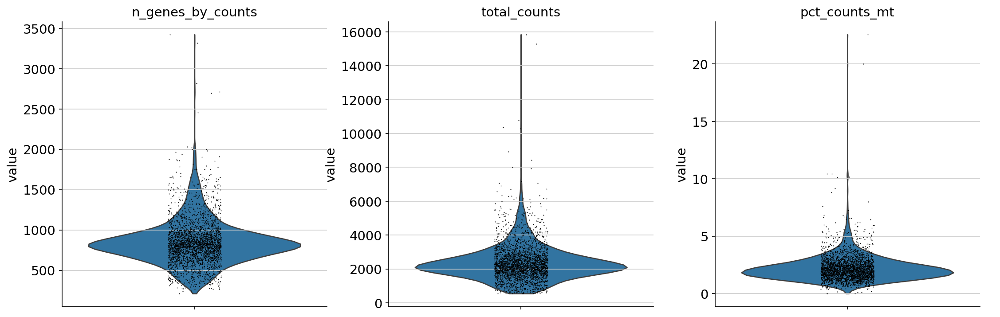
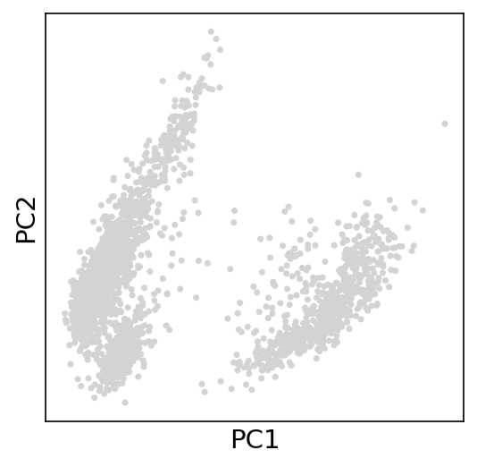
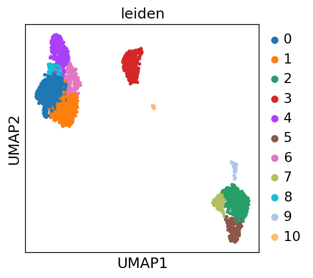
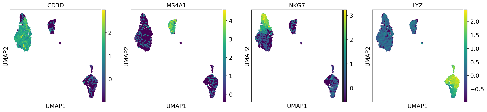
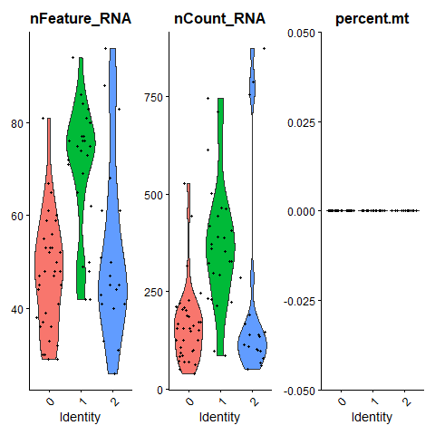
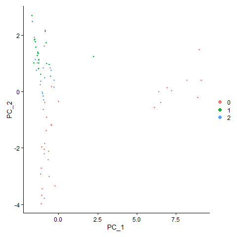
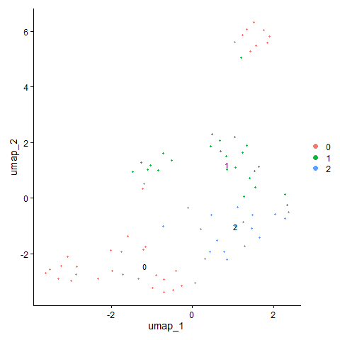
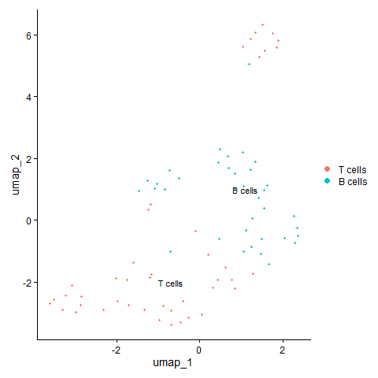

# PBMC Single-Cell RNA-seq Analysis (Scanpy & Seurat)

This project performs single-cell RNA sequencing (scRNA-seq) analysis of the PBMC dataset using both Scanpy (Python) and Seurat (R). The workflow includes clustering, UMAP visualization, marker gene identification, and biological cell type annotation.

---

## Overview

Single-cell RNA sequencing enables the study of cellular heterogeneity by analyzing gene expression at the individual cell level.

This project demonstrates:

- End-to-end scRNA-seq pipeline  
- Cross-platform analysis using Scanpy and Seurat  
- Biological interpretation of immune cell populations  

PBMCs contain diverse immune cells such as T cells, B cells, NK cells, and monocytes.

---

## Dataset

- Source: 10x Genomics PBMC 3K dataset  
- Cells: ~2700  
- Genes: ~32,000  

---

## Project Structure

```bash
pbmc-scrna-analysis/
│── scanpy/
│   └── scanpy_analysis.py
│
│── seurat/
│   └── seurat_analysis.R
│
│── results/
│   └── figures/
│       ├── violin_qc.png
│       ├── pca_pca.png
│       ├── umap_umap_clusters.png
│       ├── umap_umap_markers.png
│       └── rank_genes_groups_leiden_markers.png
│
│── README.md
```

---

## Scanpy Analysis (Python)

### Workflow

- Quality control and filtering  
- Normalization and scaling  
- PCA for dimensionality reduction  
- Leiden clustering  
- UMAP visualization  
- Marker gene identification  

---

### Results and Interpretation

#### Quality Control

- Consistent gene and count distributions  
- Low mitochondrial percentage (<5%)  
- Indicates high-quality cells  



---

#### PCA

- Cells separate along principal components  
- Captures biological variability  



---

#### UMAP Clustering

- Clear cluster separation  
- Each cluster represents a distinct cell population  



---

#### Marker Gene Expression

- CD3D → T cells  
- MS4A1 → B cells  
- NKG7 → NK cells  
- LYZ → Monocytes  

These confirm biologically meaningful clustering.



---

#### Differential Expression

- Top genes distinguish clusters  
- Provides functional insights  


---

## Seurat Analysis (R)

### Workflow

- Quality control (nFeature_RNA, nCount_RNA, percent.mt)  
- Normalization and scaling  
- PCA  
- Louvain clustering  
- UMAP visualization  
- Marker-based annotation  

---

### Results and Interpretation

#### Quality Control

- Stable gene and count distributions  
- Low mitochondrial percentage  
- Indicates good data quality  




---

#### PCA

- Captures major sources of variation  
- Supports clustering  




---

#### UMAP Clustering

- Distinct clusters observed  
- Matches Scanpy clustering patterns

  

---

#### Cell Type Annotation

- Cluster 0 → T cells (CD3D)  
- Cluster 1 → B cells (MS4A1)
- 
- 

**Interpretation:**

- Marker genes confirm immune cell identity  
- Limited clusters due to small dataset (`pbmc_small`)  

---

## Cross-Platform Validation

- Scanpy and Seurat produced consistent clustering patterns  
- Marker gene expression is reproducible across tools  
- Confirms robustness of analysis  

---

## Key Biological Insights

- PBMC dataset contains diverse immune cell populations  
- Clustering reveals transcriptional heterogeneity  
- Marker genes enable accurate cell type identification  
- Both tools capture similar biological signals  

---

## Key Takeaways

- Implemented complete scRNA-seq workflow  
- Demonstrated proficiency in both Python and R  
- Performed biologically meaningful annotation  
- Ensured reproducibility across platforms  

---

## How to Run

### Scanpy (Linux CLI)

The analysis script was created and executed using the Linux command-line (nano editor).

```bash
# Navigate to script directory
cd scanpy/

# (Optional) Create or edit script
nano scanpy_analysis.py

# Run the analysis
python3 scanpy_analysis.py
```

### Seurat

```r
source("seurat/seurat_analysis.R")
```

---

## Conclusion

This project demonstrates a complete and reproducible single-cell RNA-seq analysis pipeline using both Scanpy and Seurat. The integration of computational analysis with biological interpretation enables accurate identification of immune cell populations and highlights the robustness of single-cell methodologies.
